```
===============================================================================
     _   _ _____ _____   ______  _   _ _   _ _   _ _____ ____     ___  ____  
    | \ | | ____|_   _| |  _ \ | | | | \ | | \ | | ____|  _ \   / _ \/ ___| 
    |  \| |  _|   | |   | |_) || | | |  \| |  \| |  _| | |_) | | | | \___ \ 
    | |\  | |___  | |   |  _ < | |_| | |\  | |\  | |___|  _ <  | |_| |___) |
    |_| \_|_____| |_|   |_| \_\ \___/|_| \_|_| \_|_____|_| \_\  \___/|____/ 
                                                                             
===============================================================================
              CYBERPUNK NETWORK DEFENSE OPERATING SYSTEM v2.0
                     [ FOR WINDOWS 11 SYSTEMS ONLY ]
===============================================================================
```

---

```
  +-----------------------------------------------------+
  |  >>> STATUS: ACTIVE DEVELOPMENT <<<                  |
  |  >>> LATEST UPDATE: REVOLUTIONARY VISUALS <<<        |
  |  >>> NETWATCH THREAT LEVEL: CATEGORY 4 <<<           |
  +-----------------------------------------------------+
```

---

### ++ WHAT IS THIS ++

Yo! So like... I was wondering that humans cant see atoms and all like we were taught in science, so as well we cant see signals and packets flying all around us right? Like, there is literallyyy this whole invisible digital universe floating through our bedrooms and we have zero clue! 

I just wanted to visualize that—to actually see how much is going around us in real-time, while not building something illegal cuz that would suck hahha. So heres Netrunner! It's heavily inspired from Cyberpunk, and im excitedddd to work ont his!!!

Basically, Netrunner is a network defense dashboard with a 3D interface. It captures packets off your network card, maps them into a Neo4j graph database, runs anomaly detection, and renders the whole thing as a 3D city of glowing towers that you can fly through. Think Cyberpunk 2077's breach protocol meets Wireshark meets a screensaver from hell.

---

### ++ THE SCREENSHOTS (CHECK THIS OUT!) ++

Here is what the dashboard looks like in action:

#### 1. The Neural Link Boot Sequence
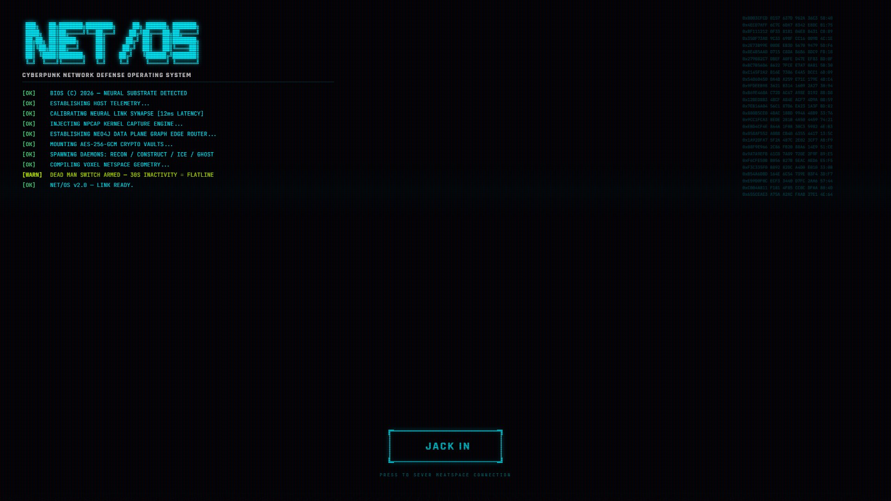
*Initializing system protocols, establishing neural interface connection with the host system.*

#### 2. The Netspace Main HUD
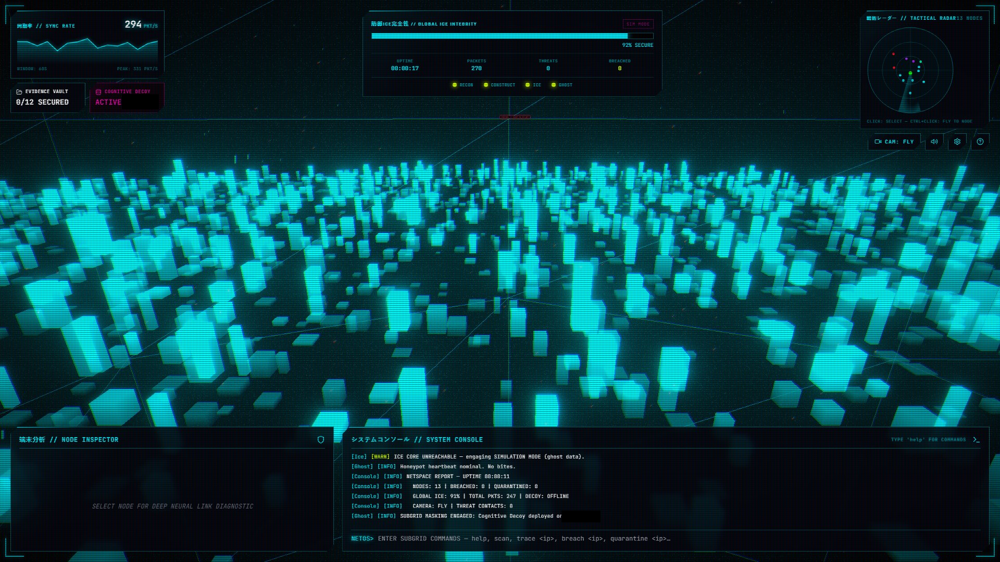
*Wide tactical view of the holographic netspace host city and command terminal.*

#### 3. Breach Protocol Decryption Matrix
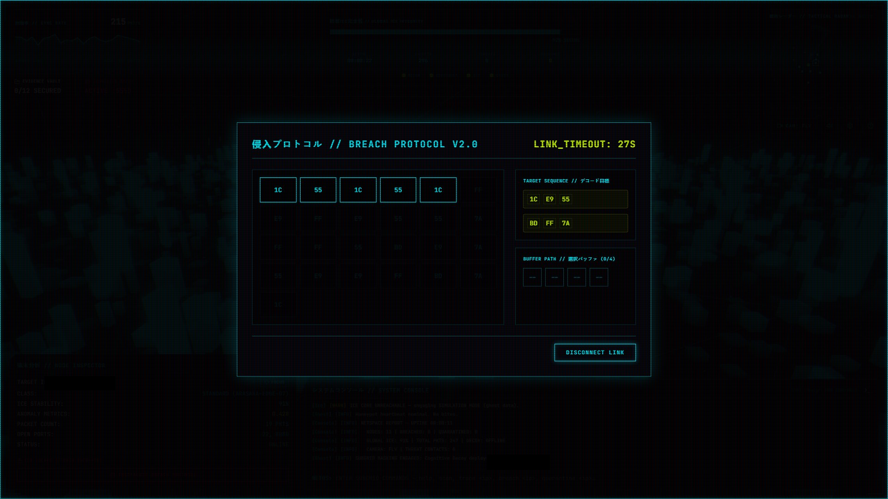
*Solving the code matrix bypass system to access secure files.*

#### 4. Decrypted Evidence Vault
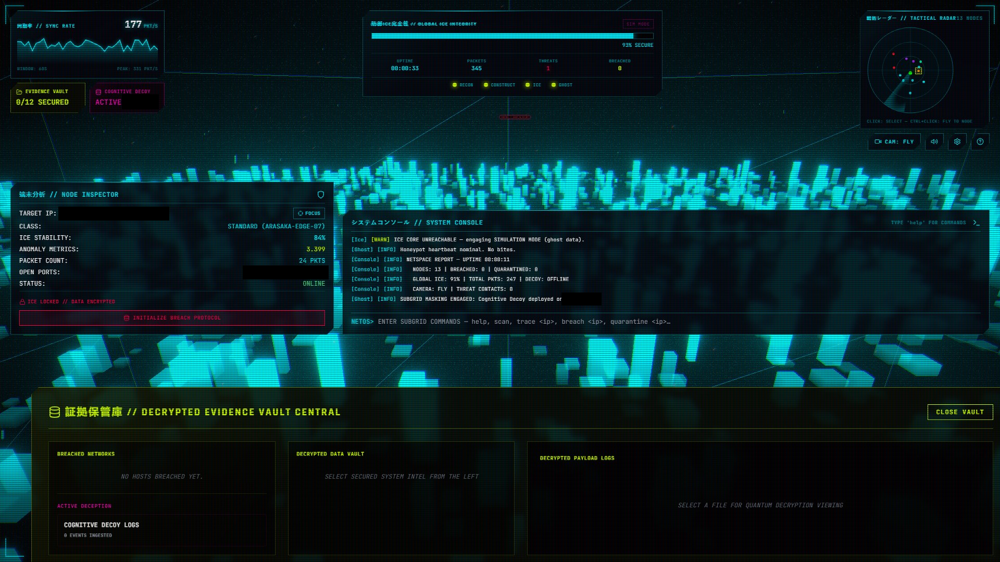
*Analyzing decrypted forensics files, connection packets, and trace logs.*

#### 5. Subgrid Node Inspector
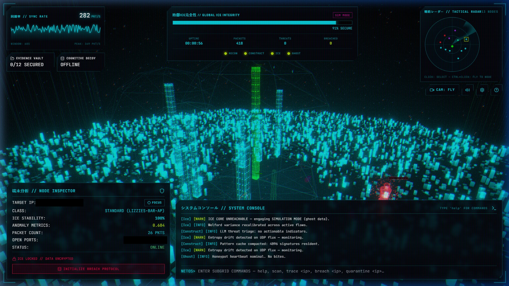
*Detail view of a remote host tower showing OS, MAC address, and active ports.*

#### 6. Operator Help Manual
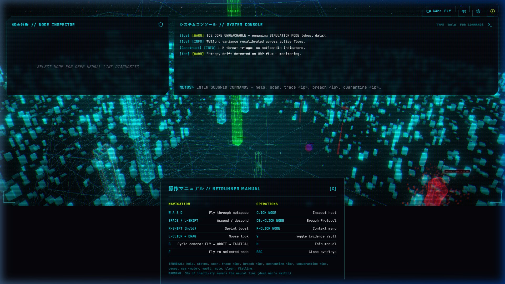
*Help panel overlay detailing command usage and cockpit keyboard shortcuts.*

#### 7. Holographic Tower Subgrid Perspective
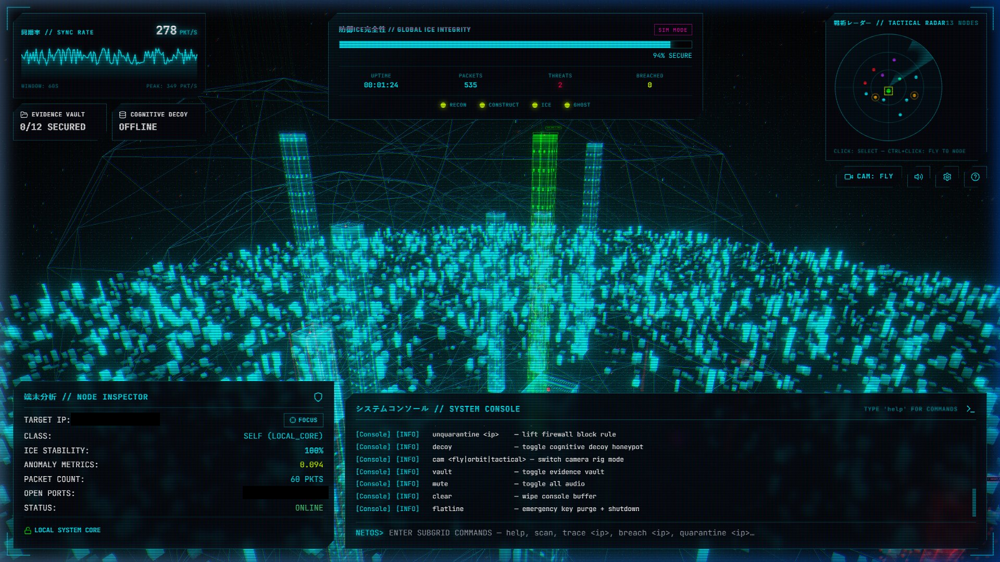
*Close-up view of instanced voxel structures indicating subgrid host nodes.*

#### 8. Local Core System Metrics
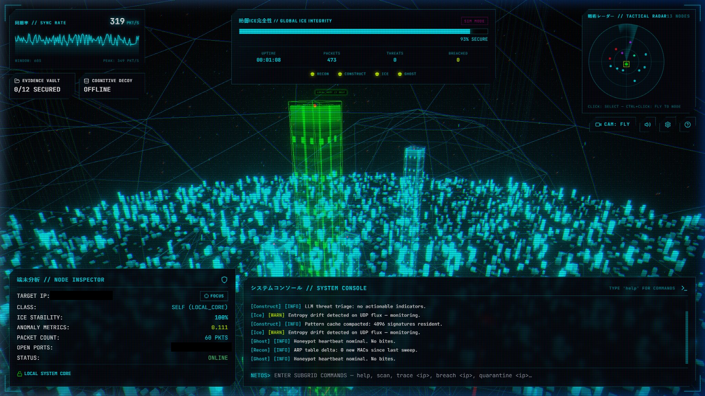
*Live display of ICE integrity, signal strength, and network telemetry.*

#### 9. Overhead Subgrid Projection Map
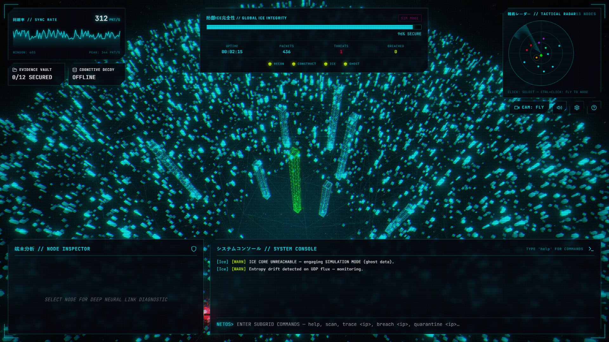
*Bird's-eye orthogonal projection of the active subgrid network topology.*

#### 10. Spherical Netspace Dome Network
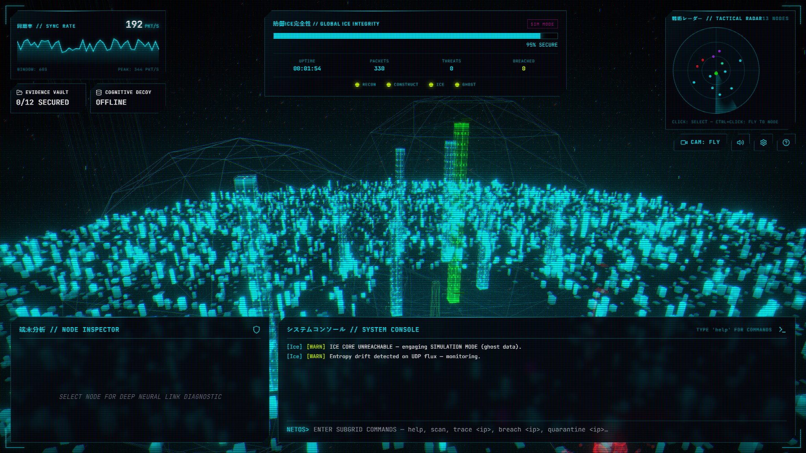
*Aesthetic view of the surrounding network grid from the central sphere.*

#### 11. Front Perspective Node Spire
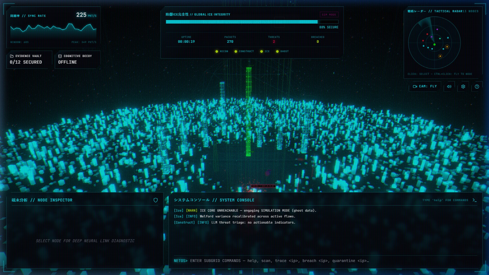
*Direct view facing the primary target host tower.*

#### 12. Critical Threat Level Alert State
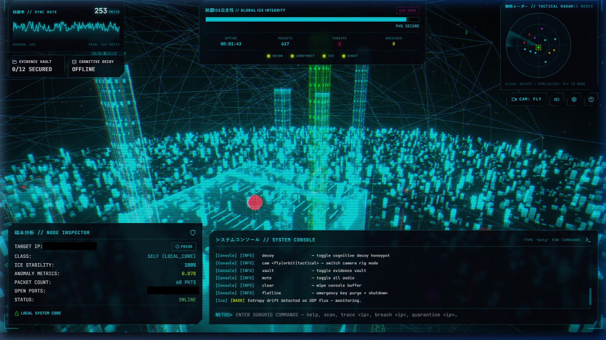
*Visual state transformation when active network anomalies are detected.*

---

### ++ HOW I MADE NETRUNNER ++

I hacked this together using:
*   **Rust (for the backend & sniffer):** The `ice/` and `jack/` modules capture raw packets and run an Axum WebSocket server to pipe data.
*   **React + Three.js + Zustand (for the 3D construct):** The frontend renders the network city and HUD diagnostics.
*   **Tauri:** Wraps the web app inside a lightweight native desktop container.
*   **AI (Sometimes!):** Let's be real—I used AI sometimes to help in debugging nasty problems cuz multithreaded packet capture in Rust is literallyyy a pain. But it works!

---

### ++ FEATURES ++

```
  [x] Real-time packet capture via Npcap
  [x] Neo4j graph topology with force-directed 3D layout
  [x] Welford's algorithm anomaly detection
  [x] Suricata EVE log monitoring
  [x] Windows Firewall quarantine (real netsh rules)
  [x] AES-256-GCM encrypted evidence locker
  [x] Breach Protocol minigame (hex matrix puzzle)
  [x] AI honeypot decoy on TCP:5555
  [x] LLM-powered threat analysis (local llama.cpp)
  [x] Three.js holographic tower visualization
  [x] Procedural Web Audio synthesizer
  [x] Dead man's switch (30s inactivity = flatline)
  [x] SHA-256 hash-chained audit log
  [x] PBKDF2 key derivation + memory zeroization
  [x] CRT scanline overlay with glitch effects
  [x] WASD fly camera + orbit + tactical modes
```

---

### ++ HOW TO RUN IT EASILY ++

#### Offline Demo Mode (No Setup Required!)
If you just want to run the frontend and see the 3D visualization without setting up Docker or databases, you can do it easily! The interface detects when the ICE backend is offline and engages **Simulation Mode** (ghost data). You can still fly around the city and play the Breach Protocol game!

1. Go to the `construct/` folder.
2. Run `npm install`
3. Run `npm run dev` (to run in browser) or `npm run tauri dev` (desktop shell).

#### Full Real-time Packet Capture Mode
To run the full stack with live packet sniffing:

1.  **Dependencies:** Ensure you have **Windows 11**, **Npcap** (installed with WinPcap compatibility mode), **Rust 1.75+**, and **Docker Desktop**.
2.  **Config:** Copy `.env.example` to `.env` and set your credentials.
3.  **Containers:** Start Neo4j and Redis:
    ```bash
    docker-compose up -d
    ```
4.  **Backend:** Run the ICE Core Engine:
    ```bash
    cargo run -p ice --release
    ```
5.  **Sniffer:** Run the Jack sniffer (MUST run as Administrator):
    ```bash
    cargo run -p jack --release
    ```
6.  **Frontend:** Run the Tauri GUI:
    ```bash
    cd construct
    npm run tauri dev
    ```

---

### ++ FUNNY THINGS / EASTER EGGS ++

*   **The Flatline Switch:** If you don't press any keys or move the mouse for 30 seconds, V (our AI presence) will literallyyy sever the neural link, zero out your memory keys, and kill the app! Don't go walk away for coffee or you'll get flatlined hahha.
*   **The CRT Overlay:** Real scanlines and screen flicker to make you feel like a hacker from a 2000s anime.
*   **Simulation Matrix:** In simulated mode, breaching a node automatically generates local mock matrix puzzles and dumps simulated malware logs!

---

### ++ WARNING ++

```
  +----------------------------------------------------------+
  | !!! THIS SOFTWARE MODIFIES YOUR WINDOWS FIREWALL !!!     |
  | !!! QUARANTINE COMMANDS ARE REAL NETSH RULES !!!          |
  | !!! THE DEAD MAN'S SWITCH WILL KILL THE PROCESS !!!      |
  | !!! ALL CRYPTO KEYS GET ZEROIZED ON FLATLINE !!!          |
  | !!! FOR AUTHORIZED SECURITY RESEARCH ONLY !!!             |
  +----------------------------------------------------------+
```

---

### ++ LICENSE ++

MIT. Do whatever you want. See `LICENSE` file.

---

```
===============================================================================
        built with mass mass mass mass mass mass energy and mass
               rust + react + three.js + neo4j + npcap
===============================================================================
       visitors since june 2026: [COUNTER BROKEN] [UNDER CONSTRUCTION]
===============================================================================
```
